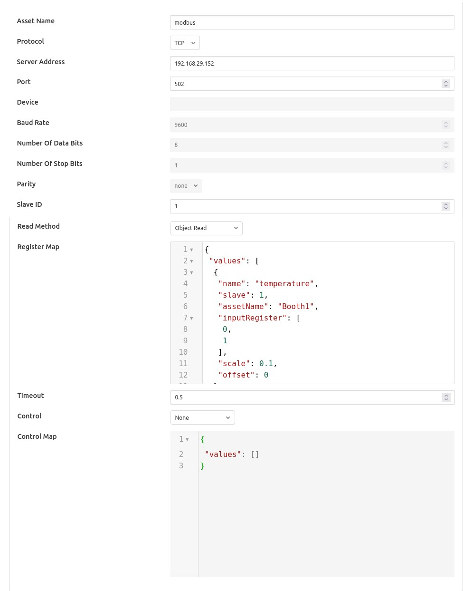
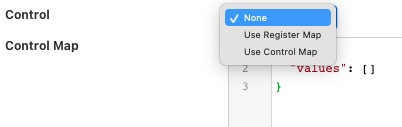

.. Images

Modbus South Plugin
===================

The *fledge-south-modbus-c* plugin is a south plugin that supports both TCP and RTU variants of Modbus. The plugin provides support for reading Modbus coils, input bits, registers and input registers, a flexible mechanism is provided to create a mapping between the Modbus registers and coils and the assets within Fledge. Multiple registers can be combined to allow larger values that then register width to be mapped from devices that represent data in this way. Support is also included for floating point representation within the Modbus registers.

Configuration Parameters
------------------------

A Modbus south service is added in the same way as any other south service in Fledge, 

  - Select the *South* menu item

  - Click on the + icon in the top right

  - Select *ModbusC* from the plugin list

  - Enter a name for your Modbus service

  - Click *Next*

  - You will be presented with the following configuration page

+------------+
| |modbus_1| |
+------------+

    - **Asset Name**: This is the name of the asset that will be used for the data read by this service. You can override this within the Modbus Map, so this should be treated as the default if no override is given.

    - **Protocol**: This allows you to select either the *RTU* or *TCP* protocol. Modbus RTU is used whenever you have a serial connection, such as RS485 for connecting to you device. The TCP variant is used where you have a network connection to your device.

    - **Server Address**: This is the network address of your Modbus device and is only valid if you selected the *TCP* protocol.

    - **Port**: This is the port to use to connect to your Modbus device if you are using the TCP protocol.

    - **Device**: This is the device to open if you are using the RTU protocol. This would be the name of a Linux device in /dev, for example /dev/SERIAL0

    - **Baud Rate**: The baud rate used to communicate if you are using a serial connection with Modbus RTU.

    - **Number of Data Bits**: The number of data bits to send on serial connections.

    - **Number of Stop Bits**: The number of stop bits to send on the serial connections.

    - **Parity**: The parity setting to use on the serial connection.

    - **Slave ID**: The slave ID of the Modbus device from which you wish to pull data.

    - **Register Map**: The register map defines which Modbus registers and coils you read, and how to map them to Fledge assets. The map is a complex JSON object which is described in more detail below.

    - **Timeout**: The request timeout when communicating with a Modbus TCP client. This can be used to increase the timeout when a slow Modbus device or network is used.

    - **Control**: Which register map should be used for mapping control entities to modbus registers.

      +------------+
      | |modbus_2| |
      +------------+

      If no control is required then this may be set to *None*. Setting this to *Use Register Map* will cause all the registers that are being rad to also be targets for control. Setting this to *Use Control Map* will case the separate *Control Map* to be used to map the control set points to modbus registers.

    - *Control Map*: The register map that is used to map the set point names into Modbus registers for the purpose of set point control. The control map is the same JSON format document as the register map and uses the same set of properties.

Register Map
~~~~~~~~~~~~

The register map is the most complex configuration parameter for this plugin and over time has supported a number of different variants. We will only document the latest of these here although previous variants are still supported. This latest variant is the most flexible to date and is thus the recommended approach to adopt.

The map is a JSON object with a single array *values*, each element of this array is a JSON object that defines a single item of data that will be stored in Fledge. These objects support a number of properties and values, these are

+---------------+-------------------------------------------------------------------------+
| Property      | Description                                                             |
+===============+=========================================================================+
| name          | The name of the value that we are reading. This becomes the name of the |
|               | data point with the asset. This may be either the default asset name    |
|               | defined plugin or an individual asset if an override is given.          |
+---------------+-------------------------------------------------------------------------+
| slave         | The Modbus slave ID of the device if it differs from the global Slave   |
|               | ID defined for the plugin. If not given the default Slave ID will be    |
|               | used.                                                                   |
+---------------+-------------------------------------------------------------------------+
| assetName     | This is an optional property that allows the asset name define for the  |
|               | plugin to be overridden on an individual basis. Multiple values in the  |
|               | values array may share the same AssetName, in which case the values     |
|               | read from the Modbus device are placed in the same asset.               |
|               |                                                                         |
|               | Note: This is unused in a control map.                                  |
+---------------+-------------------------------------------------------------------------+
| register      | This defines the Modbus register that is read. It may be a single       |
|               | register, it which case the value is the register number or it may be   |
|               | multiple registers in which case the value is a JSON array of numbers.  |
|               | If an array is given then the registers are read in the order of that   |
|               | array and combined into a single value by shifting each value up 16     |
|               | bits and performing a logical OR operation with the next register in    |
|               | the array.                                                              |
+---------------+-------------------------------------------------------------------------+
| coil          | This defines the number of the Modbus coil to read. Coils are single    |
|               | bit Modbus values.                                                      |
+---------------+-------------------------------------------------------------------------+
| input         | This defines the number of the Modbus discrete input. Coils are single  |
|               | bit Modbus values.                                                      |
+---------------+-------------------------------------------------------------------------+
| inputRegister | This defines the Modbus input register that is read. It may be a single |
|               | register, it which case the value is the register number or it may be   |
|               | multiple registers in which case the value is a JSON array of numbers.  |
|               | If an array is given then the registers are read in the order of that   |
|               | array and combined into a single value by shifting each value up 16     |
|               | bits and performing a logical OR operation with the next register in    |
|               | the array.                                                              |
+---------------+-------------------------------------------------------------------------+
| scale         | A scale factor to apply to the data that is read. The value read is     |
|               | multiplied by this scale. This is an optional property.                 |
+---------------+-------------------------------------------------------------------------+
| offset        | An optional offset to add to the value read from the Modbus device.     |
+---------------+-------------------------------------------------------------------------+
| type          | This allows data to be cast to a different type. The only support type  |
|               | currently is *float* and is used to interpret data read from the one or |
|               | more of the 16 bit registers as a floating point value. This property   |
|               | is optional.                                                            |
+---------------+-------------------------------------------------------------------------+
| swap          | This is an optional property used to byte swap values read from a       |
|               | Modbus device. It may be set to one of *bytes*, *words* or *both* to    |
|               | control the swapping to apply to bytes in a 16 bit value, 16 bit words  |
|               | in a 32 bit value or both bytes and words in 32 bit values.             |
+---------------+-------------------------------------------------------------------------+

Every *value* object in the *values* array must have one and only one of *coil*, *input*, *register* or *inputRegister* included as this defines the source of the data in your Modbus device. These are the Modbus object types and each has an address space within a typical Modbus device.

+------------------+---------+---------------+---------------+
| Object Type      | Size    | Address Space | Map Property  |
+==================+=========+===============+===============+
| Coil             | 1 bit   | 00001 - 09999 | coil          |
+------------------+---------+---------------+---------------+
| Discrete Input   | 1 bit   | 10001 - 19999 | input         |
+------------------+---------+---------------+---------------+
| Input Register   | 16 bits | 30001 - 39999 | inputRegister |
+------------------+---------+---------------+---------------+
| Holding Register | 16 bits | 40001 - 49999 | register      |
+------------------+---------+---------------+---------------+

The values in the map for coils, inputs and registers are relative to the base of the address space for that object type rather than the global address space and each is 0 based. A map value that has the property *"coil" : 10* would return the values of the tenth coil and *"register" : 10* would return the tenth register.

Example Maps
~~~~~~~~~~~~

In this example we will assume we have a cooling fan that has a Modbus interface and we want to extract three data items of interest. These items are

  - Current temperature that is in Modbus holding register 10
  
  - Current speed of the fan that is stored as a 32 bit value in Modbus holding registers 11 and 12

  - The active state of the fan that is stored in a Modbus coil 1

The Modbus Map for this example would be as follow:

.. code-block:: JSON

    {
        "values" : [
               {
                   "name"     : "temperature",
                   "register" : 10
               },
               {
                   "name"     : "speed",
                   "register" : [ 11, 12 ]
               },
               {
                   "name" : "active",
                   "coil" : 1
               }
            ]
    }

Since none of these values have an assetName defined all there values will be stored in a single asset, the name of which is the default asset name defined for the plugin as a whole. This asset will have three data points within it; *temperature*, *speed* and *active*.

Function Codes
~~~~~~~~~~~~~~

The *fledge-south-modbus-c* plugin attempts to make as few calls as possible to the underlying modbus device in order to collect the data. This is done in order to minimise the load that is placed on the modbus server. The modbus function codes used to read each coil or register type are as follows;

+------------------+----------------------------+---------+---------------+---------------+
| Object Type      | Function Code              | Size    | Address Space | Map Property  |
+==================+============================+=========+===============+===============+
| Coil             | 01 Read Coils              | 1 bit   | 00001 - 09999 | coil          |
+------------------+----------------------------+---------+---------------+---------------+
| Discrete Input   | 02 Read Discrete inputs    | 1 bit   | 10001 - 19999 | input         |
+------------------+----------------------------+---------+---------------+---------------+
| Input Register   | 04 Read register           | 16 bits | 30001 - 39999 | inputRegister |
+------------------+----------------------------+---------+---------------+---------------+
| Holding Register | 16 Read multiple registers | 16 bits | 40001 - 49999 | register      |
+------------------+----------------------------+---------+---------------+---------------+

Set Point Control
-----------------

The *fledge-south-modbus-c* plugin supports the Fledge set point control mechanisms and allows a register map to be defined that maps the set point attributes to the underlying modbus registers. As an example a control map as follows

.. code-block:: JSON

   {
       "values" : [
           {
              "name" : "active",
              "coil" : 1
           }
         ]
   }

Defines that a set point write operation can be instigated against the set point named *active* and this will map to the Modbus coil 1.

Set points may be defined for Modbus coils and registers, the rad only input bits and input registers can not be used for set point control.

The *Control Map* can use the same swapping, scaling and offset properties as modbus *Register Map*, it can also map multiple registers to a single set point and floating point values.

Error Messages
--------------

The following are messages that may be produced by the *fledge-south-modbus-c* plugin, these messages are written to the system log file and may be viewed by the *System* menu item in the Fledge user interface. This display may be filtered on the name of a particular south service in order to view just the messages that originate from that south service.

The value of slave in the modbus map should be an integer
  When a modbus slave identifier is defined within the JSON modbus map it should always be given as a integer value and should not be enclosed in quotes

  .. code-block:: JSON

     "slave" : 0

The value of slave for item 'X' in the modbus map should be an integer
  A name entity in the modbus map is defined as a string and must be enclosed in double quotes. This error would indicate that a non-string value has been given.

  .. code-block:: JSON

     "name" : "speed"

Each item in the modbus map must have a name property
  Each of the modbus entities that is read must define a name property for the entity.

  .. code-block:: JSON

     "name" : "speed"

The value of assetName for item 'X' in the modbus map should be a string
  The optional property *assetName* must always be provided as a string in the modbus map.

  .. code-block:: JSON

     "assetName" : "pumpSpeed"

The value of scale for item 'X' in the modbus map should be a floating point number
  The optional property *scale* must always be expressed as a numeric value in the JSON of the modbus map, and should not be enclosed in quotes.

  .. code-block:: JSON

     "scale" : 1.4

The value of offset for item 'X' in the modbus map should be a floating point number
  The optional property *offset* must always be given as a numeric value in the JSON definition of the modbus item, and should not be enclosed in quotes.

  .. code-block:: JSON

     "offset" : 2.0

The value of coil for item 'X' in the modbus map should be a number
  The coil number given in the modbus map of an item must be an integer number, and should not be enclosed in quotes.

  .. code-block:: JSON

     "coil" : 22

The value of input for item 'X' in the modbus map must be either an integer
  The input number given in the modbus map of an item must be an integer number, and should not be enclosed in quotes.

  .. code-block:: JSON

     "input" : 22

The value of register for item 'X' in the modbus map must be either an integer or an array
  The register to read for an entity must be either an integer number or in the case of values constructed from multiple registers it may be an array of integer numbers. Numeric values should not be enclosed on quotes.

  .. code-block:: JSON

     "register" : 22

   Or

  .. code-block:: JSON

     "register" : [ 18, 19 ]

The register array for item 'X' in the modbus map contain integer values
  When giving an array as the value of the register property for a modbus item, that array must only contain register numbers expressed as numeric values. Register numbers should not be enclosed in quotes.

  .. code-block:: JSON

     "register" : [ 18, 19 ]

The value of inputRegister for item 'X' in the modbus map must be either an integer or an array
  The input register to read for an entity must be either an integer number or in the case of values constructed from multiple input registers it may be an array of integer numbers. Numeric values should not be enclosed on quotes.

  .. code-block:: JSON

     "inputRegister" : 22

   Or

  .. code-block:: JSON

     "inputRegister" : [ 18, 19 ]

The type property of the item 'X' in the modbus map must be a string
  The optional *type* property for a modbus entity must be expressed as a string enclosed in double quotes.

  .. code-block:: JSON

     "type" : "float"

The type property 'Y' of the item 'X' in the modbus map is not supported
  The *type* property of the item is not supported by the plugin. Only the type *float* is currently supported.

The swap property 'Y' of item 'X' in the modbus map must be one of bytes, words or both
  An unsupported option has been supplied as the value of the swap property, only *bytes*, *words* or *both* are supported values.

The swap property of the item 'X' in the modbus map must be a string
  The optional *swap* property of a modbus item must be given as a string in double quotes and must be one of the supported swap options.

  .. code-block:: JSON

     "swap" : "bytes"

Item 'X' in the modbus map must have one of coil, input, register or inputRegister properties
  Each modbus item to be read from the modbus server must define how that item is addressed. This is done by adding a modbus property called *coil*, *input*, *register* or *inputRegister*.

Item 'X' in the modbus map must only have one of coil, input, register or inputRegister properties
  Each modbus item to be read from the modbus server must define how that item is addressed. This is done by adding a modbus property called *coil*, *input*, *register* or *inputRegister*, these are mutually exclusive and only one of them may be given per item in the modbus map.

N errors encountered in the modbus map
  A number of errors have been detected in the modbus map. These must be correct in order for the plugin to function correctly.

Parse error in modbus map, the map must be a valid JSON object.
  The modbus map JSON document has failed to parse. An additional text will be given that describes the error that has caused the parsing of the map to fail.

Parse error in control modbus map, the map must be a valid JSON object.
  The modbus control map JSON document has failed to parse. An additional text will be given that describes the error that has caused the parsing of the map to fail.

Failed to connect to Modbus device
  The plugin has failed to connect to a modbus device. In the case of a TCP modbus connection this could be because the address or port have been misconfigured or the modbus device is not currently reachable on the network. In the case of a modbus RTU device this may be a misconfiguration or a permissions issue on the entry in /dev for the device. Additional information will be given in the error message to help identify the issue.

